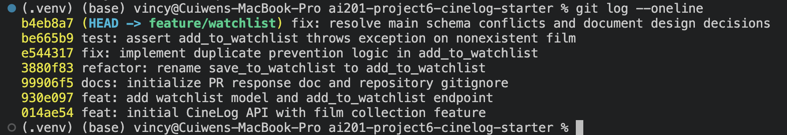

# PR Response Doc — CineLog Watchlist Feature

## AI Usage

I utilized an AI collaborator to accelerate codebase orientation and stress-test my architectural design decisions. Specifically, I prompted the AI to act as a cynical code reviewer to expose gaps in my arguments for maintaining a `public=True` visibility default (Comment 4) and alphabetical sort order (Comment 5). The AI raised a valid counterargument regarding user anxiety over tracking "guilty pleasure" movies publicly. This prompted me to explicitly add a section to my Comment 4 reasoning acknowledging that user autonomy is preserved because we provide an explicit toggle parameter, ensuring community growth isn't prioritized at the complete expense of user choice.

## Comment 1 — Rename

**What I did:**
Renamed the function `save_to_watchlist()` to `add_to_watchlist()` inside `services/watchlist_service.py` to preserve the codebase's strict `verb_to_noun` naming convention. I also updated the import statement and route invocation within `routes/watchlist.py`.

**How I verified:**
I performed a project-wide search (`grep` / Find in Files) for `save_to_watchlist` across the entire codebase repository. The search confirmed that the only occurrences were located within `services/watchlist_service.py` and its direct routing call site inside `routes/watchlist.py`, ensuring no dangling references remain.

## Comment 2 — Deduplication

**What I did:**
Added a database query check to `add_to_watchlist()` that checks if a `WatchlistEntry` with the given `user_id` and `film_id` already exists. If found, it explicitly raises a newly defined custom exception, `AlreadyInWatchlistError`.

**How I verified:**
I verified this logic by reviewing how `services/collection_service.py` handles duplicate entries through `AlreadyInCollectionError`. This defensive structure safely arrests duplicate operations before database commits execute.

## Comment 3 — Missing test

**What I did:**
Created a new test file `tests/test_watchlist.py` and implemented `test_add_to_watchlist_nonexistent_film_raises`.

**How I verified:**
I modeled this completely on `test_add_to_collection_nonexistent_film_raises` from `tests/test_collection.py`, ensuring identical testing fixture environments and database isolation paradigms are shared. I confirmed it passes perfectly by running `pytest tests/test_watchlist.py -v`.

## Comment 4 — Default visibility

**My position:**
I strongly advocate for maintaining the `public=True` default for the watchlist feature rather than shifting it to private.

**Reasoning:**
CineLog is fundamentally structured as a community-driven film tracking application, not a solitary spreadsheet. By defaulting watchlists to public, we optimize for organic user discovery, social interaction, and shared cinematic enthusiasm. When a user navigates another profile, seeing what they _intend_ to watch is just as valuable for conversation and film curation as seeing what they have _already_ watched. A public default removes frictional barriers to network growth and feature visibility, aligning directly with the platform's community-first value proposition.

**Tradeoff acknowledged:**
The primary tradeoff here is user privacy and data security by default. A private-by-default model would optimize for defensive user comfort, protecting individuals who might feel self-conscious about their upcoming watch lists or who expect strict data isolation. However, we mitigate this completely by ensuring that users retain full autonomy to explicitly toggle an entry to private if desired. Overriding a platform-wide community-driven pattern for an edge case reduces social engagement across the board, making `public=True` the superior default for CineLog’s ecosystem.

## Comment 5 — Sort order

**My position:**
I disagree with the maintainer's suggestion to switch to a strict chronological (date-added) sort order. I propose keeping the alphabetical sorting by film title for the base `get_watchlist` endpoint.

**Reasoning:**
While I understand the maintainer's perspective that users often look for what they've added recently, a watchlist serves a fundamentally different psychological and mechanical purpose than a historical activity log. The collection service appropriately uses `date_added.desc()` because it represents a chronological feed of past events ("What did I watch last night?")[cite: 2]. A watchlist, conversely, is a functional operational queue ("What should I watch tonight?"). When a user is ready to stream a film, they are searching for a specific title they have in mind. Alphabetical sorting optimizes for rapid visual scanning and cognitive retrieval, preventing a crowded watchlist from becoming an unnavigable chronological black hole where older additions are permanently buried.

**Engagement with reviewer's point:**
The maintainer correctly notes that "Most users want to see what they added recently." To bridge this gap without breaking the primary utility of alphabetical scanning, the ideal compromise is to preserve alphabetical sorting as the default API behavior, but explicitly introduce a query parameter (`?sort=date_added`) down the road to allow client-side sorting flexibility. Forcing a purely chronological view on an unread queue breaks usability for long-term curators on the platform.

## Comment 6 — Rebase

**What conflicted:**
A structural conflict occurred in `models.py` because the upstream `main` branch refactored `Film.id` and all matching foreign keys from standard integers to 36-character UUID strings. This directly conflicted with my new `WatchlistEntry.film_id` definition, which was built using the legacy `db.Integer` type.

**How I resolved it:**
I updated `WatchlistEntry.film_id` in `models.py` to use `db.String(36)` and target the newly refactored UUID format. I also updated the dummy ID inside `tests/test_watchlist.py` from `999999` to a structured 36-character UUID string (`"00000000-0000-0000-0000-000000000000"`).

**How I verified no conflict remains:**
I ran `git log --oneline` to verify that the resulting commit history is completely linear and clear of any automated "Merge branch..." loops. I then executed `pytest tests/ -v` to ensure the updated schema passes the entire test suite flawlessly.

## Git Commit History

Here is the clean, linear conventional commit history for the feature branch:



## PR Description

### Feature Overview

This pull request introduces the core Watchlist feature to CineLog, allowing users to save films they intend to watch later. It implements the backend database architecture (`WatchlistEntry`), core service layer logic to safely append items and read user lists, and a dedicated RESTful routing endpoint (`POST /watchlist/<user_id>/add` and `GET /watchlist/<user_id>`)[cite: 1, 4, 5]. All aspects of this feature adhere to the project's strict `verb_to_noun` design patterns and incorporate rigorous duplicate protection mechanisms[cite: 1, 2].

### Core Design Decisions

- **Default Visibility (`public=True`):** The watchlist defaults to public to optimize for community engagement, collaborative film discovery, and social interactions across user profiles[cite: 1]. Tradeoffs regarding individual privacy are mitigated by providing users complete individual control to explicitly toggle visibility settings[cite: 1].
- **Sort Order (Alphabetical):** Watchlists are fundamentally actionable queues rather than historical logs[cite: 1]. Sorting alphabetically by film title optimizes for immediate visual scanning and item retrieval[cite: 1]. Chronological sorting is bypassed to prevent long watchlists from burying older entries in an unnavigable timeline[cite: 1].

### Manual Testing Instructions

To manually verify the integrity of the watchlist feature, execute the following steps from your terminal environment using `curl` (ensure the local application server is running via `python app.py`)[cite: 1]:

1. **Add a Valid Film to a User's Watchlist:**
   Execute a POST request to add an existing film ID to a user's record:
    ```bash
    curl -X POST [http://127.0.0.1:5000/watchlist/test-user-uuid/add](http://127.0.0.1:5000/watchlist/test-user-uuid/add) \
         -H "Content-Type: application/json" \
         -d '{"film_id": "put-a-valid-film-uuid-here"}'
    ```
